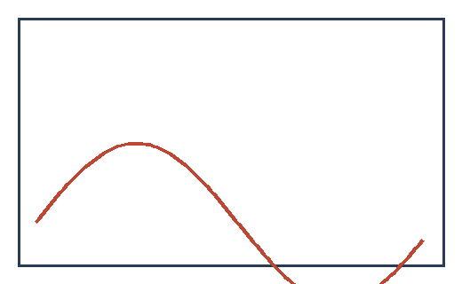

# Story Images

This story is an ordinary Markdown file with an `images/` folder beside it. It
opens in any Markdown editor with a working preview, because every image
reference in it is a plain relative path resolved the way every Markdown tool
resolves one.

## A figure image

An image alone in its own paragraph is a figure. Its caption comes from its alt
text, and it is numbered in the same sequence as the plots.

The photograph above is 1800 pixels wide in the source tree. The build
downscales it, strips the metadata a camera would have attached, and bundles
the converted copy, so what ships is neither the original file nor a link to
one.

## A caption that differs from the alt text

Where the visible caption and the screen reader description should say
different things, the Markdown title slot carries the caption.

## An inline image

An image written inside a sentence, like this
{width=8mm} one, is not a figure. It gets no caption
and no number, because it is punctuation rather than an exhibit — and a width
is how you keep it that size.

## Referring to a figure

Both Markdown image forms work, and the reference form is the natural way to
give an image a stable anchor to point at:

![The same rig, referenced by label][rig]

[rig]: images/bench-rig.jpg

Because that image is referenced twice, it is converted and packaged once.

## Sizing an image

An image draws at its natural size by default, capped to the text column, which
is rarely what a diagram wants. A width can be written at the reference, in
millimetres or as a percentage of the column:

{width="35%"}

The photograph below is declared 90mm wide in the build script, so every
reference to it draws at that size without repeating the number.

A width in millimetres is a physical size: it is 90mm on paper and the same
fraction of the column on screen, because the story has a page.

## Referring to a figure by number

Prose refers to a numbered figure with an ordinary Markdown link whose text is
a bare caption word. The build fills in the number, so it can never go stale:
the rig appears in [Figure](#bench-rig), and the trace in [Fig.](#signal-path).

In a plain Markdown preview those read as "Figure" and "Fig." — the sentence
still works, it is just missing the digit until the story is built.
